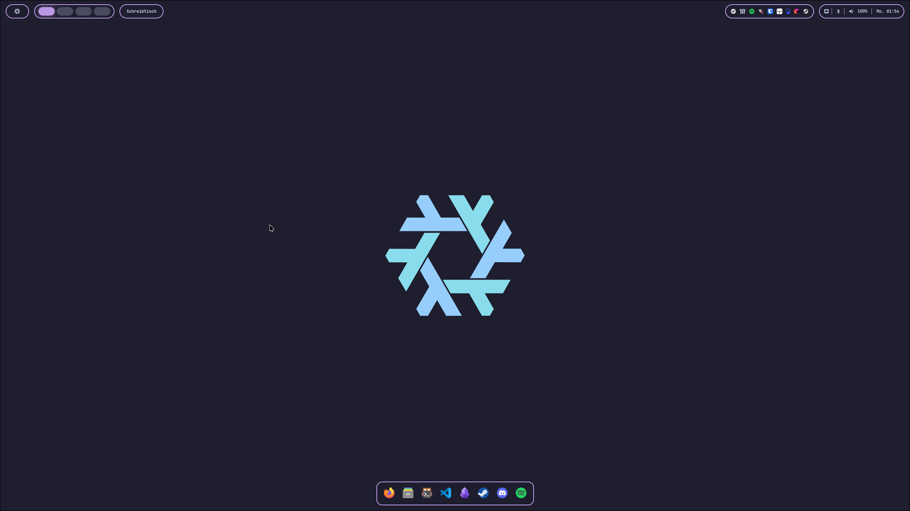

# NixOS Config

My personal NixOS configurations using Flakes and Home-Manager.



## Structure

```
hosts/          # Per-host configs
modules/
  system/       # Boot, networking, impermanence, snapshots
  desktop/      # Hyprland, KDE, SDDM
  home-manager/ # User programs, dotfiles, theming
sops/           # Encrypted secrets
```

## Quick Start

- **Fresh install:** [docs/INSTALL.md](docs/INSTALL.md)
- **Use as base for your config:** [docs/QUICKSTART.md](docs/QUICKSTART.md)
- **Configuration reference:** [docs/CONFIG.md](docs/CONFIG.md)

## Features

All features are toggleable per host:

```nix
features.server = true;               # Minimal server (no desktop, optimized kernel)
features.impermanence.enable = false; # Disable root wipe on boot
features.gaming.enable = false;       # No Steam/gaming
features.desktop.wm = "kde";          # Hyprland or KDE
```

## Using as Flake Input

This flake exports `lib.mkHost` for building NixOS systems:

```nix
# your-repo/flake.nix
{
  inputs.samuels-config.url = "github:user/nix";  # or path:/path/to/nix

  outputs = { samuels-config, ... }: {
    nixosConfigurations.my-host = samuels-config.lib.mkHost {
      hostName = "my-host";
      hostPath = ./hosts/my-host;
      serverMode = true;              # Optional: minimal server (no desktop, optimized kernel)
      extraModules = [ /* ... */ ];   # Optional: additional modules
    };

    # Optional: Declarative disk partitioning
    diskoConfigurations.my-host = samuels-config.lib.mkDisko ./hosts/my-host;
  };
}
```

**Included:**
- System modules (audio, networking, boot, impermanence, snapshots)
- Desktop environments (Hyprland, KDE)
- Home-Manager + Catppuccin theming
- SOPS secrets, Disko partitioning
- CachyOS kernel (desktop + server variants)

**Server mode:** Disables desktop/audio/bluetooth/WiFi/development/gaming/virtualisation. Keeps SSH, Tailscale, CLI tools.

See [docs/QUICKSTART.md](docs/QUICKSTART.md) for detailed setup guide.
