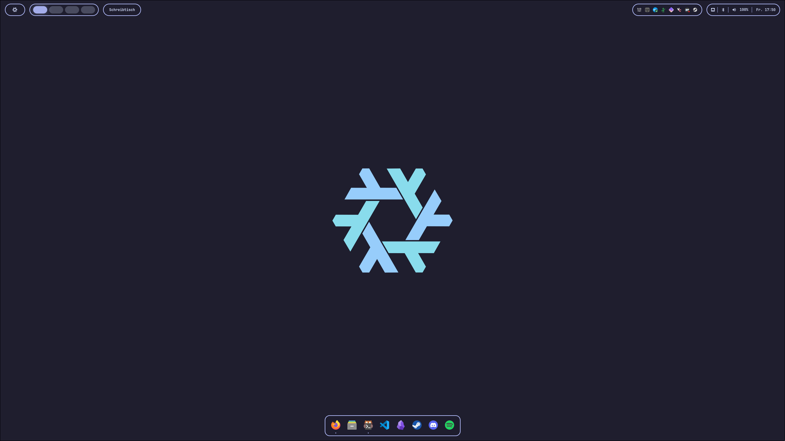
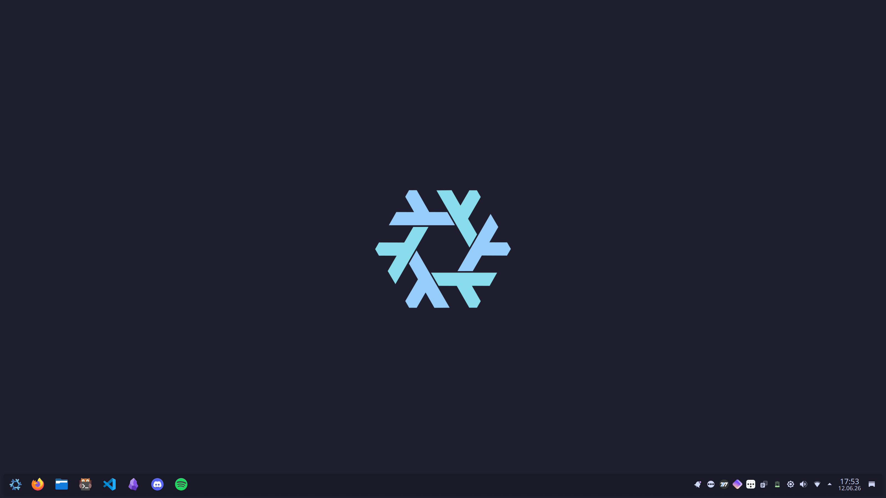

# NixOS Config

My personal NixOS configurations using Flakes and Home-Manager.



<details>
<summary>Show KDE Plasma Preview</summary>
<br>



</details>

## Structure

```
hosts/          # Per-host configs
modules/
  system/       # Boot, networking, impermanence, snapshots
  desktop/      # Hyprland, KDE, SDDM
  home-manager/ # User programs, dotfiles, theming
sops/           # Encrypted secrets
```

## Quick Start

- **Fresh install:** [docs/INSTALL.md](docs/INSTALL.md)
- **Use as base for your config:** [docs/QUICKSTART.md](docs/QUICKSTART.md)
- **Configuration reference:** [docs/CONFIG.md](docs/CONFIG.md)
- **Security overview:** [docs/SECURITY.md](docs/SECURITY.md)

## Host Overrides

Common per-host overrides:

```nix
features.server = true;                         # Minimal server (no desktop, optimized kernel)
features.impermanence.enable = false;           # Disable root wipe on boot
features.gaming.enable = false;                 # No Steam/gaming
features.gaming.steamMachine.enable = true;     # Steam Gamescope session / Steam Machine mode
features.desktop.wm = "kde";                    # Hyprland or KDE
features.desktop.fileManager = "terminal";       # Yazi instead of GUI file manager
displays.defaults.hdr = 1;                       # Unknown display HDR: 0=off, 1=Steam, 2=full desktop
displays.defaults.vrr = 2;                       # Default VRR for unknown hotplug displays where supported
```

## Using as Flake Input

This flake exports `lib.mkHost` for building NixOS systems. See [docs/QUICKSTART.md](docs/QUICKSTART.md) for setup guide.
