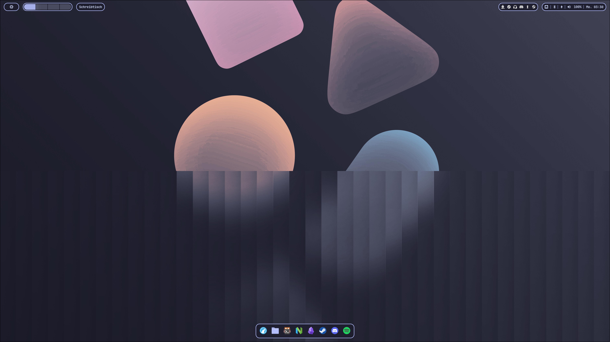
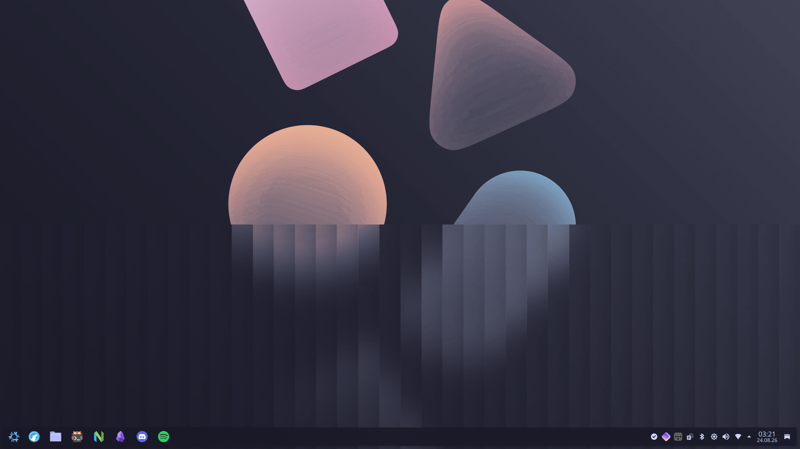

# NixOS Config

My personal NixOS configurations using Flakes and Home-Manager.



<details>
<summary>Show KDE Plasma Preview</summary>
<br>



</details>

## Structure

```
hosts/              # Per-host configs
modules/
  system/           # Boot, networking, impermanence, snapshots
  desktop/          # Hyprland, KDE, SDDM
  home-manager/     # User programs, dotfiles, theming
sops/               # Encrypted secrets
```

## Quick Start

- **Fresh install:** [docs/INSTALL.md](docs/INSTALL.md)
- **Use as base for your config:** [docs/QUICKSTART.md](docs/QUICKSTART.md)
- **Configuration reference:** [docs/CONFIG.md](docs/CONFIG.md)
- **Security overview:** [docs/SECURITY.md](docs/SECURITY.md)

## Host Overrides

Common per-host overrides. Uncomment only the settings that differ from the
defaults:

```nix
# Hardware identity and form factor
# features.hardware.formFactor = "laptop";        # "desktop" (default) or "laptop"
# features.hardware.cpu = "amd";                  # "amd" or "intel", enables CPU microcode
# features.hardware.gpu = "amd";                  # "amd" or "intel", enables graphics/VA-API

# Desktop session
# features.desktop.wm = "kde";                     # "hyprland" (default) or "kde"
# features.desktop.login = "autologin";           # "greeter" (default) or "autologin"
# features.desktop.fileManager = "terminal";      # "default" (default) or Yazi via "terminal"
# features.desktop.browser.enable = false;         # Disable the managed browser completely
# features.desktop.browser.type = "firefox";       # "librewolf" (default) or "firefox"
# features.desktop.browser.homepage = "https://dash.example.com";
# features.desktop.browser.searchEngine = "ddg";    # DuckDuckGo (default)
# features.desktop.browser.cookieAllowlist = [     # Append first-party sessions
#   "https://example.com"
#   "https://*.example.com"                        # Subdomains
# ];

# System behavior
# features.impermanence.enable = false;            # Keep the root filesystem instead of rolling back
# features.encryption.unlockMethod = "yubikey";    # "tpm2" (default), "yubikey", or "password"

# Optional workloads
# features.gaming.enable = false;                  # Disable Steam and gaming tools
# features.gaming.steamMachine.enable = true;      # Add a Steam Gamescope session
# features.dev.enable = false;                     # Disable development tools and IDEs
# features.apps.enable = false;                    # Disable optional desktop applications
# features.virtualisation.enable = false;          # Disable Podman and QEMU/KVM support
```

Display defaults are configured separately when needed:

```nix
# displays.defaults.hdr = 1;                       # 0=off, 1=Steam, 2=full desktop
# displays.defaults.vrr = 2;                       # VRR mode for unknown displays
```

## Using as Flake Input

This flake exports `lib.mkHost` for building NixOS systems. See [docs/QUICKSTART.md](docs/QUICKSTART.md) for setup guide.
