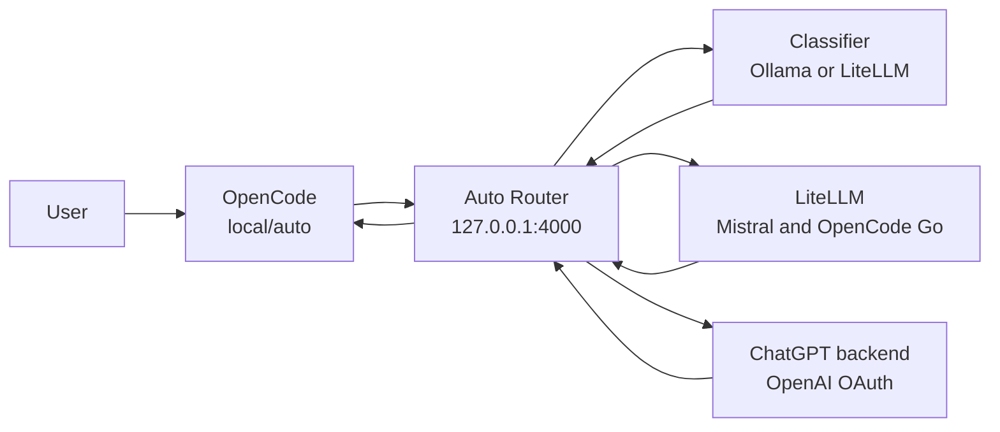

# OpenCode Auto Router

The OpenCode Auto Router gives OpenCode a single default model, `local/auto`. You use OpenCode normally; the router chooses a suitable backend for each request and reports the model at the end of the response.

The router is enabled whenever `features.development.opencode.enable` is enabled. Set `features.development.opencode.classifier` to `local` for Ollama classification or `cloud` for classification through a small cloud model without running Ollama.

## Source Layout

- `default.nix` imports the complete feature.
- `client.nix` configures OpenCode and its visible model catalog.
- `services.nix` builds and runs the rootless Podman stack.
- `router.py` contains classification, routing, fallback, and proxy behavior.
- `litellm.yaml` maps LiteLLM model names to upstream providers.
- `test_router.py` covers routing and proxy behavior.

Feature options remain in `modules/system/features.nix`, and individual hosts select the classifier in their host configuration. Those settings are intentionally outside this directory because they belong to global option declarations and host policy rather than the router implementation.

## Why It Exists

Different models are useful for different work. A small model is sufficient for a translation, while a difficult debugging session benefits from a stronger agentic model. Selecting models manually for every request is distracting and wastes provider capacity.

The router therefore follows three design choices:

1. Use a local classifier when sufficient VRAM is available, otherwise use a small cloud classifier.
2. Choose the least expensive model expected to complete the task well.
3. Keep provider failures and inadequate answers recoverable without hiding which model was used.

### Routing policy update

The automatic policy now treats DeepSeek and Qwen as the default cost/performance middle ground for tool-enabled work. DeepSeek Flash handles routine coding, DeepSeek Pro handles intermediate-to-complex tasks, and Qwen Plus handles general development and broad refactors. GPT models are reserved for work that is genuinely complex, ambiguous, high-stakes, or beyond the DeepSeek/Qwen capability, and for overflow when those providers are unavailable or saturated. This is a classifier preference, not a hard quota scheduler: provider availability fallback and capability escalation can still select another backend.

You can still select any model manually when you need predictable behavior.

## Request Flow



For an automatic request:

1. OpenCode sends the conversation and available tools to the router.
2. The configured classifier selects a backend. Local mode tries `llama3.2:3b` and then `qwen3:8b`; cloud mode calls `deepseek-v4-flash` through LiteLLM.
3. The router selects a backend based on task complexity, tool use, model capability, and subscription limits.
4. LiteLLM normalizes Mistral and OpenCode Go behind one local OpenAI-compatible API. ChatGPT subscription models are called directly because they use a different OAuth API.
5. The router streams the answer back to OpenCode.

## How Routing Works

The router classifies each request before sending it to a backend. This section explains the decision process.

### Classification Process

1. **Context extraction**: The router takes the last 6 messages from the conversation (truncated to 1200 characters each) to understand the request.
2. **Tool detection**: It checks whether the request includes tool definitions (file edits, shell commands, search, etc.).
3. **Classification**: The router sends the same routing prompt either to Ollama or to `deepseek-v4-flash` through LiteLLM. The classifier returns exactly one model ID.
4. **Caching**: Identical prompts are cached for 5 minutes to avoid redundant classification calls.

### Complexity Levels

The classifier evaluates requests on five levels:

- **Level 1 — Simple (no tools)**: Greetings, translations, summaries, titles, simple Q&A. Routed to `mistral-small`.
- **Level 2 — Medium reasoning (no tools)**: Architecture discussions, design tradeoffs, analysis, planning. Routed to `mistral-medium` (preferred) or `qwen3.7-max` for exceptionally complex algorithmic reasoning.
- **Level 3 — Standard coding with tools**: File edits, refactoring, shell commands, debugging, testing, NixOS config. Prefer `deepseek-v4-flash` or `qwen3.7-plus`; GPT Luna is overflow when those providers are saturated.
- **Level 4 — Intermediate-to-complex tools**: Multi-step refactors, hard bugs, deeper analysis, and broad edits. Prefer `deepseek-v4-pro` or `qwen3.7-plus`; GPT Sol is used when those models are insufficient.
- **Level 5 — Very hard problems**: Ambiguous multi-step exploration, production failures, critical system administration, race conditions, and extremely complex logic. Routed to GPT Sol or Terra as the strongest escalation tier.

### Decision Criteria

The classifier considers:

- **Tool availability**: Requests with tools (file edits, shell, search) are routed to coding-focused models. Requests without tools go to reasoning models.
- **Task complexity**: Simple tasks use small models; complex multi-step tasks use stronger models.
- **Domain**: System administration, production debugging, and ambiguous failures favor `gpt-5.6-terra` or `gpt-5.6-sol`.
- **Latency vs. quality**: Fast variants (`-fast`) are preferred when latency matters and the task is not critically complex.
- **Quota distribution**: The router spreads load across multiple providers (Mistral, OpenCode Go, ChatGPT) to avoid hitting rate limits.

### Fallback and Escalation

- **Backend fallback**: If a provider fails before the first response chunk (network error, rate limit, authentication error, timeout, or upstream error), the router walks the fallback chain defined for each model.
- **Model circuit breaker**: A failing model enters a 60-second cooldown. Other models from the same provider remain available as fallbacks.
- **Offline safety net**: Local-classifier hosts end every fallback chain at `qwen3:8b`. Cloud-classifier hosts omit Ollama from their model list and fallback chains.
- **Capability escalation**: If a user says the previous answer did not work (e.g., "that did not work", "funktioniert nicht"), the router reads the model from the previous response and escalates to the next capability tier on the next turn.

## Model Selection

Models are listed once below in the approximate order of work they are intended to handle. Both classifiers use the complete conversation, not only the latest sentence.

### Mistral

- **`mistral-small`** — Chat, translation, summaries, titles, and simple questions without tools
- **`mistral-medium`** — Architecture, planning, reviews, and analysis without tools

### OpenCode Go

- **`deepseek-v4-flash`** — Routine coding, debugging, shell work, tests, and file edits
- **`deepseek-v4-pro`** — Difficult focused engineering and debugging
- **`qwen3.7-plus`** — General development, broad edits, and an alternative to DeepSeek Flash
- **`qwen3.8-max`** — Deep mathematical, theoretical, and formal reasoning without tools; use sparingly because its Go quota is small
- **`qwen3.7-max`** — Advanced reasoning without broad tool coordination
- **`qwen3.6-plus`** — General coding when other OpenCode Go models are unavailable
- **`gpt-5.6-luna`** — Low-cost GPT overflow through OpenCode Go, with a hidden direct OpenAI route as its availability fallback

### GPT-5.6 via ChatGPT OAuth

- **`gpt-5.6-luna-fast`** — Fast GPT overflow using the priority service tier
- **`gpt-5.6-sol` / `gpt-5.6-sol-fast`** — Complex debugging, refactoring, and multi-step tool use
- **`gpt-5.6-terra` / `gpt-5.6-terra-fast`** — Ambiguous, critical, or high-stakes work; strongest tier

### OpenCode Go limits and Zen billing

OpenCode Go includes usage worth $12 per rolling five hours, $30 per week, and $60 per month. The approximate request allowances published for the Go models used here are:

| Model | Requests per 5 hours |
| --- | ---: |
| `deepseek-v4-flash` | 31,650 |
| `qwen3.7-plus` | 4,300 |
| `deepseek-v4-pro` | 3,450 |
| `qwen3.6-plus` | 3,300 |
| `gpt-5.6-luna` | 2,050 |
| `qwen3.7-max` | 340 |
| `qwen3.8-max` | 160 |

Reaching a Go limit is not necessarily observable as a rate-limit failure: subsequent Go traffic can consume the account's OpenCode Zen balance at pay-as-you-go rates. If Zen auto-reload is enabled, a balance at $5 automatically purchases $20 of credit and adds a $1.23 processing fee. Consequently, the router cannot reliably detect exhausted Go allowance from HTTP errors and switch providers before Zen is charged. Its DeepSeek/Qwen-first policy and quota hints reduce likely cost but do not enforce a spending cap; account billing settings remain the hard control.

Relevant Zen prices per one million tokens are:

| Model | Input | Output | Cached read | Cached write |
| --- | ---: | ---: | ---: | ---: |
| `deepseek-v4-flash` | $0.14 | $0.28 | $0.028 | — |
| `gpt-5.6-luna` (up to 272K tokens) | $0.20 | $1.20 | $0.02 | $0.25 |
| `gpt-5.6-luna` (over 272K tokens) | $0.40 | $1.80 | $0.04 | $0.50 |
| `qwen3.7-plus` | $0.40 | $1.60 | $0.04 | $0.50 |
| `qwen3.6-plus` | $0.50 | $3.00 | $0.05 | $0.625 |
| `deepseek-v4-pro` | $1.74 | $3.48 | $0.145 | — |
| `qwen3.7-max` | $2.50 | $7.50 | $0.50 | $3.125 |
| `gpt-5.6-terra` (up to 272K tokens) | $2.00 | $12.00 | $0.20 | $2.50 |
| `gpt-5.6-terra` (over 272K tokens) | $4.00 | $18.00 | $0.40 | $5.00 |
| `gpt-5.6-sol` (up to 272K tokens) | $5.00 | $30.00 | $0.50 | $6.25 |
| `gpt-5.6-sol` (over 272K tokens) | $10.00 | $45.00 | $1.00 | $12.50 |

The supplied pricing table does not list a pay-as-you-go price for `qwen3.8-max`, so no price is assumed here. The direct GPT routes use ChatGPT OAuth rather than the OpenCode Go API; the Zen pricing table describes Go/Zen traffic, not ChatGPT subscription billing.

### Local Ollama

These models are available only when `features.development.opencode.classifier = "local"`.

- **`llama3.2:3b`** — Local classifier and fallback classifier; not selected as an answer model by auto-routing
- **`qwen3:8b`** — Offline and privacy-sensitive work; also the final automatic fallback when cloud providers are unavailable

The broad routing policy:

- Simple, non-agentic requests use Mistral Small.
- Analysis and design without tools use Mistral Medium.
- Routine work with tools uses DeepSeek Flash, Qwen Plus, or Luna.
- Difficult multi-step work uses DeepSeek Pro or Sol.
- The hardest or highest-risk work uses Terra.

For tool-enabled requests, the router also injects a persistence instruction. Multi-part requests are treated as one assignment, remaining work is tracked with the todo tool when available, and the agent is told to continue through implementation and verification instead of stopping after the first subtask. OpenCode's automatic context compaction, tool-output pruning, and high agent step limit keep long sessions within the model context window.

The router exposes OpenCode-compatible reasoning content for every model entry. Backends that provide reasoning summaries therefore appear as timed `Thought` entries in OpenCode in both automatic and manual modes. ChatGPT Responses API reasoning-summary events are translated to the OpenAI-compatible `reasoning_content` field; LiteLLM reasoning fields pass through unchanged.

## Retries and Fallbacks

The router handles two different failure modes.

**Backend fallback** applies when a model fails before the first response chunk, for example because of a network failure, timeout, rate limit, missing authentication, context limit, or upstream server error. The router follows the configured fallback chain until a backend accepts the request. A model-level circuit breaker prevents subsequent requests from retrying the failing model while keeping other models from the same provider available. The cooldown state is visible in `/health`. Once streaming has started, the router cannot replace that response, but an interrupted stream puts that model on cooldown for the next request.

**Capability escalation** applies when a backend returned an answer but the user says that the attempt failed or asks it to try again. On the next turn, the router reads the model recorded on the previous response and moves to the next capability tier. This is separate from provider availability fallback and prevents a failed task from repeatedly returning to the same small model.

Every automatic response starts with a compact routing notice:

```markdown
> **mistral-small**
> Simple question
```

The classifier writes a two-to-six-word reason in the language of the most recent user message.

If a backend fallback or capability escalation occurred, the notice shows the path:

```markdown
> **mistral-small -> mistral-medium**
> Deeper analysis
```

The blockquote and bold text clearly separate routing metadata from the model's answer. This notice is debug information and not part of the assistant's reasoning. OpenCode title and summary requests suppress it entirely.

## Providers and Authentication

LiteLLM is not an AI provider. It is the local compatibility layer at 127.0.0.1:8000 that gives the router one OpenAI-compatible endpoint for Mistral and OpenCode Go.

### Provider Authentication

- **Mistral API** — SOPS secret `opencode/mistral/api-key`, exposed to LiteLLM as `MISTRAL_API_KEY`
- **OpenCode Go** — SOPS secret `opencode/opencode-go/api-key`, exposed to LiteLLM as `OPENCODE_GO_API_KEY`
- **ChatGPT subscription** — OpenCode OAuth entry in `~/.local/share/opencode/auth.json`
- **Local Ollama** — No external credential

The SOPS secrets are rendered into a systemd-managed environment file and passed only to the LiteLLM container. They are not stored in `litellm.yaml`.

ChatGPT authentication works differently. OpenCode creates the OAuth entry through its OpenAI authentication plugin. The host file `~/.local/share/opencode/auth.json` is mounted into the router container as `/var/lib/opencode/auth.json`. The router reads the `openai` OAuth entry, refreshes expired access tokens with its refresh token, and writes refreshed credentials back to the same mounted file. It then calls the ChatGPT Codex backend directly with the account ID from the OAuth data.

## Manual Selection

Select `local/auto` for normal use. A specific `local/<model>` entry, for example `local/gpt-5.6-terra`, bypasses classification and capability escalation but retains reasoning display, tool support, persistence instructions, and availability fallback. Local-classifier hosts additionally expose `local/qwen3:8b`.

## Components

- **`opencode-auto-router`** at `127.0.0.1:4000` — Classification, backend selection, ChatGPT OAuth, fallback, and response metadata
- **`opencode-litellm`** at `127.0.0.1:8000` — OpenAI-compatible adapter for Mistral and OpenCode Go
- **`opencode-ollama`** at `127.0.0.1:11434` — Optional local classifier and offline model runtime
- **`opencode-auto-router-sync-models.service`** — On local-classifier hosts, pulls configured Ollama models and removes stale ones

The containers run rootless in one Podman pod and communicate through localhost. Cloud-classifier hosts run only LiteLLM and the router; local-classifier hosts additionally run Ollama.

## Operations

The services are user services:

```bash
systemctl --user status podman-opencode-ollama.service
systemctl --user status podman-opencode-litellm.service
systemctl --user status podman-opencode-auto-router.service
systemctl --user status opencode-auto-router-sync-models.service
```

The Ollama and model-sync services exist only on local-classifier hosts.

Check the local endpoints:

```bash
curl http://127.0.0.1:11434/api/tags
curl http://127.0.0.1:4000/health
```

After changing the module, rebuild the Home Manager configuration and restart OpenCode. OpenCode loads provider configuration only at startup.

Run the router tests from the repository root:

```bash
nix shell --impure --expr \
  'with import <nixpkgs> {}; python3.withPackages (ps: with ps; [ pytest fastapi httpx ])' \
  -c pytest modules/home-manager/programs/opencode-auto-router/test_router.py
```
