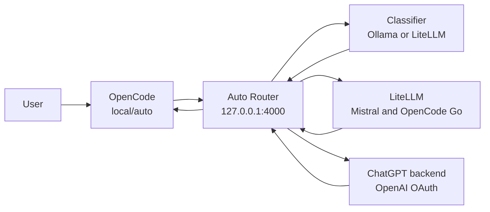

# OpenCode Auto Router

The OpenCode Auto Router gives OpenCode a single default model, `local/auto`. You use OpenCode normally; the router chooses a suitable backend for each request and reports the model at the end of the response.

The router is enabled whenever `features.development.opencode.enable` is enabled. Set `features.development.opencode.classifier` to `local` for Ollama classification or `cloud` for classification through a small cloud model without running Ollama.

## Source Layout

The router is implemented as a self-contained package at `modules/packages/opencode-router/`:

```
modules/packages/opencode-router/
├── flake.nix              # Sub-flake exposing package, image, and module
├── rust/                  # Rust source code
│   ├── Cargo.toml
│   ├── Cargo.lock
│   ├── config/            # Default configuration
│   ├── src/               # Router implementation
│   └── tests/             # Integration tests and fixtures
└── nix/                   # Nix modules
    ├── module.nix         # Unified options interface
    ├── router.nix         # Generates router.toml
    ├── litellm.nix        # Generates litellm.yaml
    ├── client.nix         # Configures OpenCode client
    ├── services.nix       # Podman container orchestration
    ├── secrets.nix        # SOPS secrets management
    └── package.nix        # Rust package and Docker image
```

The home-manager module at `modules/home-manager/programs/opencode-auto-router/default.nix` is a thin interface that imports the package module and sets model configuration.

Feature options remain in `modules/system/features.nix`, and individual hosts select the classifier in their host configuration. Those settings are intentionally outside this directory because they belong to global option declarations and host policy rather than the router implementation.

## Why It Exists

Different models are useful for different work. A small model is sufficient for a translation, while a difficult debugging session benefits from a stronger agentic model. Selecting models manually for every request is distracting and wastes provider capacity.

The router therefore follows three design choices:

1. Use a local classifier when sufficient VRAM is available, otherwise use a small cloud classifier.
2. Choose the least expensive model expected to complete the task well.
3. Keep provider failures and inadequate answers recoverable without hiding which model was used.

### Routing policy update

The router uses a guidance-based classifier that selects the best model for each task based on capability needs, tool usage, quota availability, and task difficulty. Models are organized into provider families with escalation ladders:

- **Qwen family**: `qwen3.7-plus` → `qwen3.7-max` → `qwen3.8-max`
- **DeepSeek family**: `deepseek-v4-flash` → `deepseek-v4-pro`
- **GPT family**: `gpt-5.6-luna` → `gpt-5.6-luna-fast` → `gpt-5.6-terra` → `gpt-5.6-terra-fast` → `gpt-5.6-sol` → `gpt-5.6-sol-fast`
- **Mistral family**: `mistral-small` → `mistral-medium`

The classifier provides guidance (not rigid rules) to the local LLM, which then chooses the best fit. When a model fails to produce a solution within a session, it is temporarily banned for 10 minutes and the router escalates to the next model in the family ladder. Provider exhaustion (429) creates a 15-minute ban; authentication failures (401/403) create a 10-minute ban. This is a classifier preference, not a hard quota scheduler: provider availability fallback, temporary rotation bans, and capability escalation can still select another backend.

You can still select any model manually when you need predictable behavior.

## Request Flow



For an automatic request:

1. OpenCode sends the conversation and available tools to the router.
2. The configured classifier selects a backend. Local mode tries `qwen3:8b`; cloud mode calls the neutral `mistral-small` classifier through LiteLLM.
3. The router selects a backend based on task complexity, tool use, model capability, and subscription limits.
4. LiteLLM normalizes Mistral and OpenCode Go behind one local OpenAI-compatible API. ChatGPT subscription models are called directly because they use a different OAuth API.
5. The router streams the answer back to OpenCode.

## How Routing Works

The router classifies each request before sending it to a backend. This section explains the decision process.

### Classification Process

1. **Context extraction**: The router takes the last 6 messages from the conversation (truncated to 1200 characters each) to understand the request.
2. **Tool detection**: It checks whether the request includes tool definitions (file edits, shell commands, search, etc.).
3. **Classification**: The router sends the same routing prompt either to Ollama or to `mistral-small` through LiteLLM. The classifier returns exactly one model ID and receives currently banned models so it can avoid them.
4. **Caching**: Identical prompts are cached for 5 minutes to avoid redundant classification calls.

### Complexity Levels

The classifier evaluates requests on five levels:

- **Level 1 — Trivial**: Greetings, translations, Q&A, titles. Routed to `mistral-small` only for the simplest tasks; otherwise skipped.
- **Level 2 — Standard**: File edits, shell commands, debugging, testing, NixOS config, architecture, planning. Routed to `deepseek-v4-flash` (coding), `qwen3.7-plus` (general dev), or `mistral-medium` (analysis/planning).
- **Level 3 — Complex**: Multi-step refactors, hard bugs, deeper analysis, broad edits. Routed to `deepseek-v4-pro`, `gpt-5.6-terra`, or `qwen3.7-max`.
- **Level 4 — Hard**: Ambiguous multi-step exploration, deep reasoning, complex systems. Routed to `qwen3.8-max` or `gpt-5.6-sol-fast`.
- **Level 5 — Hardest**: Critical bugs, race conditions, production failures, high-stakes system administration. Routed to `gpt-5.6-sol` only.

### Decision Criteria

The classifier considers:

- **Tool availability**: Requests with tools (file edits, shell, search) are routed to coding-focused models. Some reasoning models also handle tools well (e.g. mistral-medium for mixed analysis/coding).
- **Task complexity**: Simple tasks use small models; complex multi-step tasks use stronger models.
- **Domain**: System administration, production debugging, and ambiguous failures favor `gpt-5.6-terra` or `gpt-5.6-sol`.
- **Latency vs. quality**: Fast variants (`-fast`) are preferred when latency matters and the task is not critically complex.
- **Quota distribution**: The router spreads load across multiple providers (Mistral, OpenCode Go, ChatGPT) to avoid hitting rate limits.

### Fallback and Escalation

- **Backend fallback**: If a provider fails before the first response chunk (network error, rate limit, authentication error, timeout, or upstream error), the router walks the fallback chain defined for each model. Fallback routes through the same family first (e.g., `deepseek-v4-flash` → `deepseek-v4-pro`) before crossing to other providers.
- **Model circuit breaker**: Failures trigger an exponential-backoff cooldown starting at 30 seconds and doubling up to a 5-minute maximum (30s → 60s → 120s → 240s → 300s). Network errors and 5xx responses cool down every model on the affected provider at once, while rate limits (429) create a 15-minute ban on the model that hit its quota. Auth failures (401/403) create a 10-minute ban. A successful request resets the backoff.
- **Session-quality banning**: When a model fails to produce a solution within a session (user says "that did not work", or the model produces no final response), it is temporarily banned for 10 minutes and the router escalates to the next model in the family ladder.
- **Load-balancing rotation**: After fifteen consecutive requests, the selected model is temporarily banned for two minutes — but only while an equally capable alternative within the same family is available, so the router never bans every good model at once. The classifier receives the ban list.
- **Title fallback**: Title and summary requests use a cheap-only chain: Mistral Small, Mistral Medium, DeepSeek Flash, then GPT Luna Fast. Local-classifier hosts add local Qwen as the final safety net; expensive Terra/Sol models are not used for metadata.
- **Offline safety net**: Local-classifier hosts end every fallback chain at `qwen3:8b`. Cloud-classifier hosts omit Ollama from their model list and fallback chains.
- **Capability escalation**: If a user says the previous answer did not work (e.g., "that did not work", "funktioniert nicht"), the router reads the model from the previous response and escalates to the next model in the family ladder first, then crosses to other families if needed:
  - **Mistral**: `small` → `medium` → (cross to `deepseek-v4-flash`)
  - **DeepSeek**: `flash` → `pro` → (cross to `qwen3.7-max`)
  - **Qwen**: `7-plus` → `7-max` → `8-max` → (cross to `gpt-5.6-terra`)
  - **GPT-5.6**: `luna` → `luna-fast` → `terra` → `terra-fast` → `sol` → `sol-fast`

## Model Selection

Models are listed once below in the approximate order of work they are intended to handle. Both classifiers use the complete conversation, not only the latest sentence.

### Mistral

- **`mistral-small`** — Entry route for trivial chat, translation, titles, and Q&A without tools; never a generic fallback for substantive work
- **`mistral-medium`** — Architecture, planning, reviews, analysis, and mixed analysis/coding; capable with and without tools

### OpenCode Go

- **`deepseek-v4-flash`** — Fast coding model for bugs, refactors, multi-step changes, file edits, shell, NixOS, containers; high quota (158K req/month)
- **`deepseek-v4-pro`** — Stronger DeepSeek for complex work: multi-step exploration, deep analysis with tools; 17K req/month quota
- **`qwen3.7-plus`** — General development and broad refactors with tools; solid coding model; 22K req/month quota
- **`qwen3.8-max`** — Top Qwen reasoning model for complex algorithmic analysis, math, deep design review; 810 req/month quota
- **`qwen3.7-max`** — Advanced reasoning, complex algorithmic analysis, math; 1.7K req/month quota
- **`gpt-5.6-luna`** — GPT entry tier via OpenCode Go; good general-purpose model; 10K req/month quota

### GPT-5.6 via ChatGPT OAuth

- **`gpt-5.6-luna-fast`** — Fast GPT overflow using the priority service tier
- **`gpt-5.6-terra` / `gpt-5.6-terra-fast`** — Complex structured work: hard debugging, multi-step refactors
- **`gpt-5.6-sol` / `gpt-5.6-sol-fast`** — Hardest problems: ambiguous exploration, critical bugs, race conditions; strongest tier

### OpenCode Go limits and Zen billing

OpenCode Go includes usage worth $12 per rolling five hours, $30 per week, and $60 per month. The approximate request allowances published for the Go models used here are:

| Model | Requests per month |
| --- | ---: |
| `deepseek-v4-flash` | 158,150 |
| `qwen3.7-plus` | 21,600 |
| `deepseek-v4-pro` | 17,150 |
| `qwen3.7-max` | 1,690 |
| `qwen3.8-max` | 810 |
| `gpt-5.6-luna` | 10,250 |

Reaching a Go limit is not necessarily observable as a rate-limit failure: subsequent Go traffic can consume the account's OpenCode Zen balance at pay-as-you-go rates. If Zen auto-reload is enabled, a balance at $5 automatically purchases $20 of credit and adds a $1.23 processing fee. Consequently, the router cannot reliably detect exhausted Go allowance from HTTP errors and switch providers before Zen is charged. Its DeepSeek/Qwen-first policy and quota hints reduce likely cost but do not enforce a spending cap; account billing settings remain the hard control.

Relevant Zen prices per one million tokens are:

| Model | Input | Output | Cached read | Cached write |
| --- | ---: | ---: | ---: | ---: |
| `deepseek-v4-flash` | $0.14 | $0.28 | $0.028 | — |
| `gpt-5.6-luna` (up to 272K tokens) | $0.20 | $1.20 | $0.02 | $0.25 |
| `gpt-5.6-luna` (over 272K tokens) | $0.40 | $1.80 | $0.04 | $0.50 |
| `qwen3.7-plus` | $0.40 | $1.60 | $0.04 | $0.50 |
| `deepseek-v4-pro` | $1.74 | $3.48 | $0.145 | — |
| `qwen3.7-max` | $2.50 | $7.50 | $0.50 | $3.125 |
| `gpt-5.6-terra` (up to 272K tokens) | $2.00 | $12.00 | $0.20 | $2.50 |
| `gpt-5.6-terra` (over 272K tokens) | $4.00 | $18.00 | $0.40 | $5.00 |
| `gpt-5.6-sol` (up to 272K tokens) | $5.00 | $30.00 | $0.50 | $6.25 |
| `gpt-5.6-sol` (over 272K tokens) | $10.00 | $45.00 | $1.00 | $12.50 |

The supplied pricing table does not list a pay-as-you-go price for `qwen3.8-max`, so no price is assumed here. The direct GPT routes use ChatGPT OAuth rather than the OpenCode Go API; the Zen pricing table describes Go/Zen traffic, not ChatGPT subscription billing.

### Local Ollama

- **`qwen3:8b`** — Local classifier and offline safety net; also the final automatic fallback when cloud providers are unavailable

The broad routing policy:

- Trivial, non-agentic requests use Mistral Small (sparingly) or Mistral Medium.
- Analysis and design without tools use Mistral Medium.
- Routine work with tools uses DeepSeek Flash or Qwen 3.7 Plus.
- Difficult multi-step work uses DeepSeek Pro.
- The hardest problems use GPT-5.6 Sol (strongest) or Terra.

For tool-enabled requests, the router also injects a persistence instruction. Multi-part requests are treated as one assignment, remaining work is tracked with the todo tool when available, and the agent is told to continue through implementation and verification instead of stopping after the first subtask. OpenCode's automatic context compaction, tool-output pruning, and high agent step limit keep long sessions within the model context window.

The router exposes OpenCode-compatible reasoning content for every model entry. Backends that provide reasoning summaries therefore appear as timed `Thought` entries in OpenCode in both automatic and manual modes. ChatGPT Responses API reasoning-summary events are translated to the OpenAI-compatible `reasoning_content` field; LiteLLM reasoning fields pass through unchanged.

## Retries and Fallbacks

The router handles two different failure modes.

**Backend fallback** applies when a model fails before the first response chunk, for example because of a network failure, timeout, rate limit, missing authentication, context limit, or upstream server error. The router follows the configured fallback chain until a backend accepts the request. A provider-level circuit breaker cools down every model on the affected provider after network or server errors, while rate limits (429) create a 15-minute ban on the model that hit its quota. The cooldown grows exponentially (30s → 60s → 120s → … → 300s) and resets on success. The cooldown state is visible in `/health`. Once streaming has started, the router cannot replace that response, but an interrupted stream puts that model on cooldown for the next request.

**Session-quality banning** applies when a model fails to produce a solution within a session (user says "that did not work", or the model produces no final response). The model is temporarily banned for 10 minutes and the router escalates to the next model in the family ladder.

**Capability escalation** applies when a backend returned an answer but the user says that the attempt failed or asks it to try again. On the next turn, the router reads the model recorded on the previous response and moves to the next capability tier within the same family first, then crosses to other families if needed. This is separate from provider availability fallback and prevents a failed task from repeatedly returning to the same small model.

A routing notice appears at the start of an automatic response only when the routed model differs from the previous turn:

```markdown
> **mistral-small**
> Simple question
```

The classifier writes a two-to-six-word reason in the language of the most recent user message. Consecutive turns on the same model suppress the notice to avoid visual noise and model mimicry loops.

If a backend fallback or capability escalation occurred, the notice shows the path:

```markdown
> **mistral-small -> mistral-medium**
> Deeper analysis
```

The blockquote and bold text clearly separate routing metadata from the model's answer. This notice is debug information and not part of the assistant's reasoning. The router strips notice blockquotes from conversation history before forwarding it to a backend, so models never see the pattern and cannot imitate it. OpenCode title and summary requests suppress the notice entirely.

## Providers and Authentication

LiteLLM is not an AI provider. It is the local compatibility layer at 127.0.0.1:8000 that gives the router one OpenAI-compatible endpoint for Mistral and OpenCode Go.

### Provider Authentication

- **Mistral API** — SOPS secret `opencode/mistral/api-key`, exposed to LiteLLM as `MISTRAL_API_KEY`
- **OpenCode Go** — SOPS secret `opencode/opencode-go/api-key`, exposed to LiteLLM as `OPENCODE_GO_API_KEY`
- **ChatGPT subscription** — OpenCode OAuth entry in `~/.local/share/opencode/auth.json`
- **Local Ollama** — No external credential

The SOPS secrets are rendered into a systemd-managed environment file and passed only to the LiteLLM container. They are not stored in `litellm.yaml`.

ChatGPT authentication works differently. OpenCode creates the OAuth entry through its OpenAI authentication plugin. The host file `~/.local/share/opencode/auth.json` is mounted into the router container as `/var/lib/opencode/auth.json`. The router reads the `openai` OAuth entry, refreshes expired access tokens with its refresh token, and writes refreshed credentials back to the same mounted file. It then calls the ChatGPT Codex backend directly with the account ID from the OAuth data.

## Manual Selection

Select `local/auto` for normal use. A specific `local/<model>` entry, for example `local/gpt-5.6-terra`, bypasses classification and capability escalation but retains reasoning display, tool support, persistence instructions, and availability fallback. Local-classifier hosts additionally expose `local/qwen3:8b`.

## Components

- **`opencode-auto-router`** at `127.0.0.1:4000` — Classification, backend selection, ChatGPT OAuth, fallback, and response metadata
- **`opencode-litellm`** at `127.0.0.1:8000` — OpenAI-compatible adapter for Mistral and OpenCode Go
- **`opencode-ollama`** at `127.0.0.1:11434` — Optional local classifier and offline model runtime
- **`opencode-auto-router-sync-models.service`** — On local-classifier hosts, pulls configured Ollama models and removes stale ones

The containers run rootless in one Podman pod and communicate through localhost. Cloud-classifier hosts run only LiteLLM and the router; local-classifier hosts additionally run Ollama.

## Operations

The services are user services:

```bash
systemctl --user status podman-opencode-ollama.service
systemctl --user status podman-opencode-litellm.service
systemctl --user status podman-opencode-auto-router.service
systemctl --user status opencode-auto-router-sync-models.service
```

The Ollama and model-sync services exist only on local-classifier hosts.

Check the local endpoints:

```bash
curl http://127.0.0.1:11434/api/tags
curl http://127.0.0.1:4000/health
```

After changing the module, rebuild the Home Manager configuration and restart OpenCode. OpenCode loads provider configuration only at startup.

Run the router tests from the repository root:

```bash
cd modules/packages/opencode-router/rust && cargo test
```
