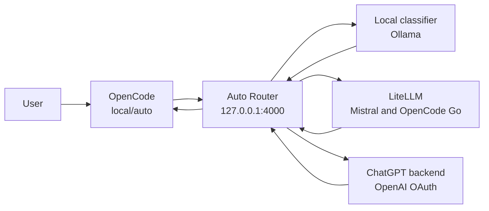

# OpenCode Auto Router

The OpenCode Auto Router gives OpenCode a single default model, `local/auto`. You use OpenCode normally; the router chooses a suitable backend for each request and reports the model at the end of the response.

The module is enabled on development machines through `features.development.enable`.

## Why It Exists

Different models are useful for different work. A small model is sufficient for a translation, while a difficult debugging session benefits from a stronger agentic model. Selecting models manually for every request is distracting and wastes provider capacity.

The router therefore follows three design choices:

1. Use a local classifier so routing decisions do not require another cloud request.
2. Choose the least expensive model expected to complete the task well.
3. Keep provider failures and inadequate answers recoverable without hiding which model was used.

You can still select any model manually when you need predictable behavior.

## Request Flow



For an automatic request:

1. OpenCode sends the conversation and available tools to the router.
2. Ollama classifies the task locally. `llama3.2:3b` is tried first and `qwen3:8b` is its classifier fallback.
3. The router selects a backend based on task complexity, tool use, model capability, and subscription limits.
4. LiteLLM normalizes Mistral and OpenCode Go behind one local OpenAI-compatible API. ChatGPT subscription models are called directly because they use a different OAuth API.
5. The router streams the answer back to OpenCode.

## How Routing Works

The router classifies each request before sending it to a backend. This section explains the decision process.

### Classification Process

1. **Context extraction**: The router takes the last 6 messages from the conversation (truncated to 1200 characters each) to understand the request.
2. **Tool detection**: It checks whether the request includes tool definitions (file edits, shell commands, search, etc.).
3. **Local classification**: The router sends a prompt to Ollama with the conversation context, tool availability, and all available models with their descriptions. Ollama returns exactly one model ID.
4. **Caching**: Identical prompts are cached for 5 minutes to avoid redundant classification calls.

### Complexity Levels

The classifier evaluates requests on five levels:

- **Level 1 — Simple (no tools)**: Greetings, translations, summaries, titles, simple Q&A. Routed to `mistral-small`.
- **Level 2 — Medium reasoning (no tools)**: Architecture discussions, design tradeoffs, analysis, planning. Routed to `mistral-medium` (preferred) or `qwen3.7-max` for exceptionally complex algorithmic reasoning.
- **Level 3 — Standard coding with tools**: File edits, refactoring, shell commands, debugging, testing, NixOS config. Routed to `deepseek-v4-flash`, `openai-luna-fast`, `openai-luna`, or `qwen3.7-plus`.
- **Level 4 — Complex agentic with tools**: Multi-step exploration, difficult bugs, race conditions, high-stakes reviews, system administration. Routed to `deepseek-v4-pro`, `openai-sol`, `openai-sol-fast`, or `openai-terra`.
- **Level 5 — Very hard problems**: Extremely complex logic, distributed systems, critical bugs. Routed to `openai-terra`, `deepseek-v4-pro`, or `qwen3.7-max`.

### Decision Criteria

The classifier considers:

- **Tool availability**: Requests with tools (file edits, shell, search) are routed to coding-focused models. Requests without tools go to reasoning models.
- **Task complexity**: Simple tasks use small models; complex multi-step tasks use stronger models.
- **Domain**: System administration, production debugging, and ambiguous failures favor `openai-terra` or `openai-sol`.
- **Latency vs. quality**: Fast variants (`-fast`) are preferred when latency matters and the task is not critically complex.
- **Quota distribution**: The router spreads load across multiple providers (Mistral, OpenCode Go, ChatGPT) to avoid hitting rate limits.

### Fallback and Escalation

- **Backend fallback**: If a provider fails before the first response chunk (rate limit, authentication error, context limit), the router walks the fallback chain defined for each model.
- **Capability escalation**: If a user says the previous answer did not work (e.g., "that did not work", "funktioniert nicht"), the router reads the model from the previous response and escalates to the next capability tier on the next turn.

## Model Selection

Models are listed once below in the approximate order of work they are intended to handle. The local classifier uses the complete conversation, not only the latest sentence.

### Mistral

- **`mistral-small`** — Chat, translation, summaries, titles, and simple questions without tools
- **`mistral-medium`** — Architecture, planning, reviews, and analysis without tools

### OpenCode Go

- **`deepseek-v4-flash`** — Routine coding, debugging, shell work, tests, and file edits
- **`deepseek-v4-pro`** — Difficult focused engineering and debugging
- **`qwen3.7-plus`** — General development, broad edits, and an alternative to DeepSeek Flash
- **`qwen3.7-max`** — Advanced reasoning without broad tool coordination
- **`qwen3.6-plus`** — General coding when other OpenCode Go models are unavailable

### ChatGPT

- **`openai-luna` / `openai-luna-fast`** — Daily agentic development; fast uses the priority service tier
- **`openai-sol` / `openai-sol-fast`** — Complex debugging, refactoring, and multi-step tool use
- **`openai-terra` / `openai-terra-fast`** — Ambiguous, critical, or high-stakes work; strongest tier

### Local Ollama

- **`llama3.2:3b`** — Local classifier and fallback classifier; not selected as an answer model by auto-routing
- **`qwen3:8b`** — Manual offline or privacy-sensitive work; not selected as an answer model by auto-routing

The broad routing policy:

- Simple, non-agentic requests use Mistral Small.
- Analysis and design without tools use Mistral Medium.
- Routine work with tools uses DeepSeek Flash, Qwen Plus, or Luna.
- Difficult multi-step work uses DeepSeek Pro or Sol.
- The hardest or highest-risk work uses Terra.

## Retries and Fallbacks

The router handles two different failure modes.

**Backend fallback** applies when a provider fails before the first response chunk, for example because of a rate limit, missing authentication, a context limit, or an upstream server error. The router follows the configured fallback chain until a backend accepts the request. Once streaming has started, it cannot replace that response.

**Capability escalation** applies when a backend returned an answer but the user says that the attempt failed or asks it to try again. On the next turn, the router reads the model recorded on the previous response and moves to the next capability tier. This is separate from provider availability fallback and prevents a failed task from repeatedly returning to the same small model.

Every automatic response ends with a highlighted routing notice:

```markdown
> **Router:** mistral-small
```

If a backend fallback or capability escalation occurred, the notice shows the path:

```markdown
> **Router:** mistral-small -> mistral-medium
```

The blockquote and bold label clearly separate routing metadata from the model's answer. This line is debug information and not part of the assistant's response. OpenCode title and summary requests suppress this notice entirely.

## Providers and Authentication

LiteLLM is not an AI provider. It is the local compatibility layer at 127.0.0.1:8000 that gives the router one OpenAI-compatible endpoint for Mistral and OpenCode Go.

### Provider Authentication

- **Mistral API** — SOPS secret `opencode/mistral/api-key`, exposed to LiteLLM as `MISTRAL_API_KEY`
- **OpenCode Go** — SOPS secret `opencode/opencode-go/api-key`, exposed to LiteLLM as `OPENCODE_GO_API_KEY`
- **ChatGPT subscription** — OpenCode OAuth entry in `~/.local/share/opencode/auth.json`
- **Local Ollama** — No external credential

The SOPS secrets are rendered into a systemd-managed environment file and passed only to the LiteLLM container. They are not stored in `litellm.yaml`.

ChatGPT authentication works differently. OpenCode creates the OAuth entry through its OpenAI authentication plugin. The host file `~/.local/share/opencode/auth.json` is mounted into the router container as `/var/lib/opencode/auth.json`. The router reads the `openai` OAuth entry, refreshes expired access tokens with its refresh token, and writes refreshed credentials back to the same mounted file. It then calls the ChatGPT Codex backend directly with the account ID from the OAuth data.

## Manual Selection

Select `local/auto` for normal use. To bypass classification and automatic fallback, choose any specific `local/<model>` entry in OpenCode, for example `local/openai-terra`, `local/qwen3:8b`, or `local/llama3.2:3b`.

## Components

- **`opencode-auto-router`** at `127.0.0.1:4000` — Classification, backend selection, ChatGPT OAuth, fallback, and response metadata
- **`opencode-litellm`** at `127.0.0.1:8000` — OpenAI-compatible adapter for Mistral and OpenCode Go
- **`opencode-ollama`** at `127.0.0.1:11434` — Local classifier and offline model runtime
- **`opencode-auto-router-sync-models.service`** — Pulls configured Ollama models and removes stale ones

All three containers run rootless in one Podman pod and communicate through localhost.

## Operations

The services are user services:

```bash
systemctl --user status podman-opencode-ollama.service
systemctl --user status podman-opencode-litellm.service
systemctl --user status podman-opencode-auto-router.service
systemctl --user status opencode-auto-router-sync-models.service
```

Check the local endpoints:

```bash
curl http://127.0.0.1:11434/api/tags
curl http://127.0.0.1:4000/health
```

After changing the module, rebuild the Home Manager configuration and restart OpenCode. OpenCode loads provider configuration only at startup.
